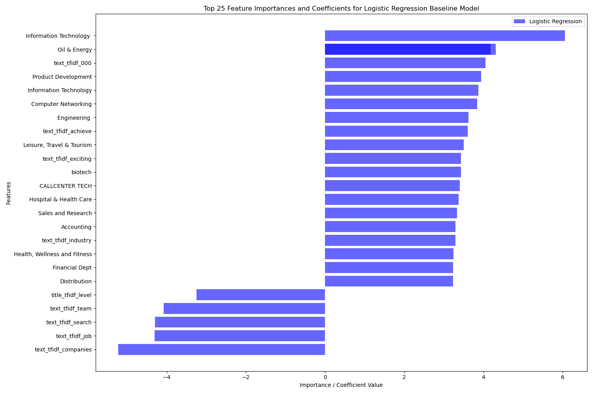

# Practical-Assignment-20.1-Initial-Report-and-EDA

# Job Scam Classification - Initial Report and EDA

[Click here for exploratory data analysis](/exploratory_data_analysis.ipynb)

The Jupyter notebook can be found in `exploratory_data_analysis.ipynb` 

## Research Question

What are the strongest indicators of a fraudulent job posting?

## Summary

For this module, I built an initial EDA and baseline binary classification model to classify a job posting as legitimate or fraudulent. My long-term goal is to implement an application to help job seekers determine the legitimacy of a job posting, as the current state of the job market is fraught with recruitment scams.

While platforms like Hugging Face and Kaggle contain datasets of unclassified job postings, the *Employment Scam Aegean Dataset* is the one dataset that focuses on this specific problem. As I work on this project, I may consider enrichment through other datasets.

## Dataset

- *Dataset used*: Employment Scam AEGEAN Dataset: https://github.com/FelixLuciano/Fake-JobPosting-Prediction
- This dataset contains job posting information, e.g. job title, description, company profile, telecommute, salary range, etc.

## Initial Results

A logistic regression model leveraging one hot encoding and TFIDF for the following features:

- title
- department
- company_profile
- description
- requirements
- benefits
- telecommuting
- has_company_logo
- has_questions
- required_experience
- required_education
- industry
- function

to classify a job posting as fraudulent or legitimate, resulted in the following scores

F1 Score: ~0.7125
ROC AUC Score: ~0.8591
Recall: ~0.7368

and a fit time of 2.95 seconds, which is a significant baseline for model deployment.

These are decent results for the baseline model, which can be further improved via additional datasets that identify "scam" key words, and other more advanced algorithms e.g. XGBoost, BERT, Transformers, to improve the above scores.

## Interpretation

The baseline result indicates IT is one of the departments most susceptible to fraudulency, followed closely by Oil and Energy, Product Development, and Computer Networking. Of the keywords from using TFIDF, "achieve" and "exciting" align with the expectations of suspicious agencies using emotionally charged buzz words to attract candidates. Words like "industry" could indicate that fraudulent postings employ vague language.

Stronger indicators of legitimate job postings are words like "level" and "team" which could relate the seniority, team focus that could align more with the specificity for a legitimate job posting. 

## Reflection

While the initial EDA employed SMOTE for handling this severely imbalanced dataset, the oversampling of the fraudulent class led to:

- the model catching almost 3/4 fraudulent postings
- 63 legitimate postings flagged as fraud. This could be a heavier cost for a desperate job searcher, whereas negligible for a casual job seeker. 
- 50 missed fraudulent job postings.

The curve rises steeply to ~0.73 TPR before the elbow. At a very low false positive rate the model already catches nearly 3/4 of fraud.

## Next Steps

**Threshold tuning** offers the most immediate gain. Could lowering the classification threshold below the default 0.5  make models more aggressive in flagging fraud? For some job seekers who can higher false positives, this could prove efficient. A precision-recall curve analysis would allow this trade-off to be set deliberately based on platform tolerance.

**Transformer architectures** like BERT could unlock deeper semantic understanding. Rather than relying on individual TF-IDF tokens, BERT's contextual embeddings could identify recurring phrases, sentence-level deception patterns, and subtle tonal shifts that bag-of-words features cannot capture.

**Feature enrichment** through external datasets could broaden the model's fraud vocabulary:

- The [UCI SMS Spam Collection](https://archive.ics.uci.edu/dataset/228/sms+spam+collection) would expose the model to cross-domain deceptive language — urgency cues, financial bait, and data harvesting prompts beyond job-specific vocabulary
- The [LinkedIn Job Postings Dataset](https://huggingface.co/datasets/datastax/linkedin_job_listings), while unlabeled for fraud, would provide contemporary posting norms against which anomalies could be benchmarked

**Temporal validation** is also critical. Fraudulent tactics evolve rapidly, and evaluating current models against more recent postings would test whether learned signals still generalize or have drifted.

A combination of these strategies would advance this baseline toward a deployable, production-grade job scam detection system.
